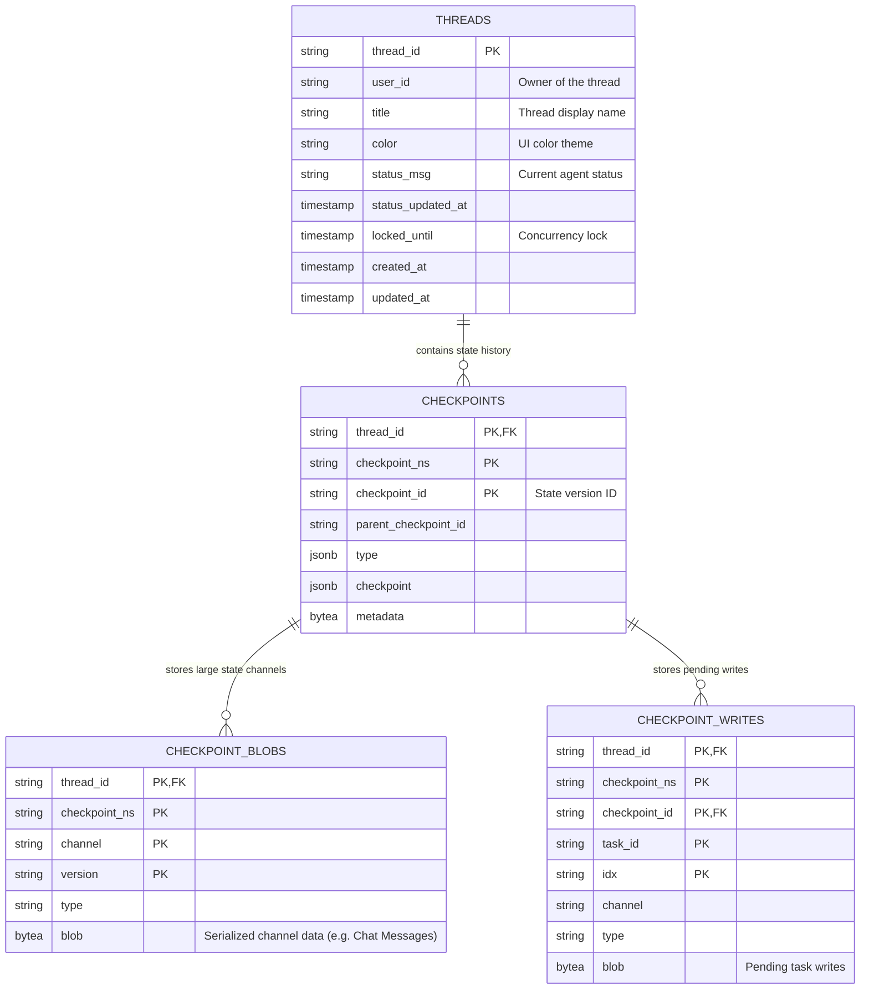

# AI Agent Chat Application

This project consists of an Angular Frontend and a Python Backend (using LangGraph), designed to run as independent Docker containers.

## Project Structure
- `agent-ui-container/`: Angular Application
- `agent-be-container/`: Python Backend (Poetry, Aiohttp, LangGraph)

## Running the Application

### Prerequisites
- Docker

### 1. Database (PostgreSQL)
Run the following command to start a PostgreSQL container:

```bash
make db-local
```

### 2. Backend
Build and run the backend container. It needs to connect to the Postgres database.

**Run:**
```bash
make agent-be-docker-run
```
*Note: This target handles building the image and setting up environment variables.*

### 3. Frontend
Build and run the frontend container.

**Run:**
```bash
make agent-ui-docker-run
```

Access the application at `http://localhost:4200`.

## Features
- **Multi-User Isolation**: Chats are isolated by User ID (Mocked via Login screen).
- **Persistent History**: Chat history is stored in PostgreSQL.
- **LangGraph Agent**: Uses LangGraph with Postgres Checkpointing.

## Data Persistence Architecture

The application uses PostgreSQL to store two different scopes of data: Application Metadata and LangGraph State (which includes chat messages).



### 1. Application Metadata (`threads` table)
Managed natively by the backend application (see `agent-be-container/migrations/001_initial_schema.sql`).
It tracks the *existence* and UI-level metadata of a chat session.
- **`thread_id`**: The unique identifier for a chat. Used by LangGraph as the thread identifier.
- **`user_id`**: Associates the thread with a specific user for isolation.
- **Core Data**: Title, UI color theme, current agent running status messages, and concurrency locks (`locked_until`).

### 2. Agent State & Messages (`checkpoints_*` tables)
Managed automatically by LangGraph's internal `AsyncPostgresSaver`.
It persists the *State* of the AI agent at each node transition, including the entire conversation history.
- **`checkpoints`**: Stores the metadata and version controlling of the graph state at each step.
- **`checkpoint_blobs`**: Stores the actual serialized state channels. **This is where the actual Chat Messages are physically stored** as serialized binary blobs, linked directly to the `thread_id`.
- **`checkpoint_writes`**: Used by LangGraph for internal task management and pending state writes during complex graph executions.

## Development (Local)

**Backend:**
```bash
# Ensure Postgres is running on localhost:5432
make agent-be-dev
```

**Frontend:**
```bash
make agent-ui-dev
```

## GitHub Actions & Continuous Deployment

This repository uses GitHub Actions to build and publish Docker images when code is merged to `main`.

A deployment workflow (`update-fluxcd.yml`) automatically updates the image tags in the `fluxcd-dev/` directory to deploy the new images. In order to bypass branch protections and commit directly to the `main` branch, it requires a Personal Access Token (PAT).

### Setting up the PAT Secret
1. Create a Personal Access Token (PAT) in GitHub:
   - **Classic Token:** Requires the `repo` scope.
   - **Fine-grained Token (Recommended):** Requires `Contents: Read and write` repository permissions.
2. Go to your repository settings on GitHub.
3. Navigate to **Secrets and variables > Actions**.
4. Create a new repository secret named `PAT` and paste the token value.
