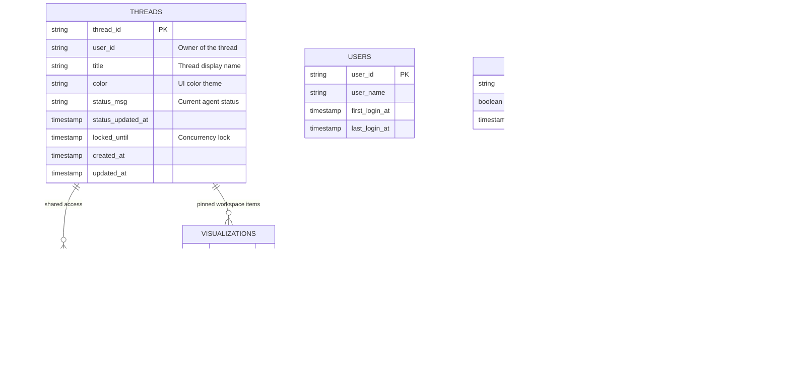

# AI Agent Chat & Form Canvas Application

This project consists of an Angular Frontend and a Rust Backend, designed to run as independent Docker containers.

## Project Structure
- `agent-ui-container/`: Angular Application (Module Federation Remote / Host Shell)
- `agent-be-container/`: High-performance Rust Backend (Tokio, Axum, rig-core, AG-UI protocol over SSE, RFC 6902 JSON Patch state delta handling, inspired by `agent-as-data` and `Graphrag`)

> 📖 **New to the app? Check out the [Getting Started Tutorial](docs/GETTING_STARTED.md)** for a guided walkthrough of the split-pane workspace and live co-editing canvas.

## Running the Application

### Prerequisites
- Docker

### 1. Database (PostgreSQL)
Run the following command to start a PostgreSQL container:

```bash
make db-local
```

### 2. Backend (`agent-be-container`)
Run the Rust backend locally or via Cargo/Docker:

```bash
# Run locally
make agent-be-dev

# Run tests
make agent-be-test

# Build/run container
make agent-be-docker-run
```

### 3. Frontend
Build and run the frontend container.

**Run:**
```bash
make agent-ui-docker-run
```

Access the application at `http://localhost:4200`.

## Features
- **Multi-User Isolation**: Chats are isolated by User ID.
- **Persistent History**: Chat history and thread state are stored in PostgreSQL.
- **Interactive Workspace**: A dynamic panel for pinning, editing, and reordering visualizations (Charts, JSON, Mermaid diagrams) using a BREAD (Browse, Read, Edit, Add, Delete) toolset.
- **Bidirectional Agentic Form Canvas (`agent-be-container`)**:
  - Real-time split-pane collaboration between direct human form inputs (RHS) and conversational agent actuation (LHS).
  - Server-Sent Events (SSE) compliant with AG-UI v1.0 protocol.
  - RFC 6902 JSON Patch state deltas (`STATE_DELTA`) with conflict prevention for user-focused fields.
  - Dynamic schema-driven tools for form mutation, hot-swapping forms (`switch_active_form`), and human-in-the-loop submission approvals (`request_form_submission`).
  - Sample test forms provided under `agent-be-container/tests/sample_forms/` (`vendor_onboarding_v2.json`, `expense_claim_v1.json`).

## Data Persistence Architecture

The application uses PostgreSQL (managed via `agent-be-container/src/migrations.rs`) to persist thread metadata, thread access control, users, pinned visualizations, agent definitions, and user settings, alongside in-memory active session state (`SessionStore` / `DashMap`).


```mermaid
erDiagram
    THREADS {
        string thread_id PK
        string user_id "Owner of the thread"
        string title "Thread display name"
        string color "UI color theme"
        string status_msg "Current agent status"
        timestamp status_updated_at
        timestamp locked_until "Concurrency lock"
        timestamp created_at
        timestamp updated_at
    }

    THREAD_ACCESS {
        string thread_id PK, FK
        string user_id PK
        string access_level
        timestamp granted_at
    }

    VISUALIZATIONS {
        uuid id PK
        string thread_id FK
        string mfe
        string component
        jsonb content
        string description
        int order_index
    }

    USERS {
        string user_id PK
        string user_name
        timestamp first_login_at
        timestamp last_login_at
    }

    USER_SETTINGS {
        string user_id PK
        boolean learning_mode_enabled
        timestamp updated_at
    }

    AGENT_DEFINITIONS {
        uuid id PK
        string name
        string content
        timestamp created_at
    }

    THREADS ||--o{ THREAD_ACCESS : "shared access"
    THREADS ||--o{ VISUALIZATIONS : "pinned workspace items"
```

### Persistence Overview
- **`threads` & `thread_access`**: Tracks chat sessions, owner isolation, UI metadata, concurrency locks, and shared read/write access.
- **`visualizations`**: Stores pinned workspace items and live MFE canvas payloads (`JSONB`) synchronized via RFC 6902 JSON Patches.
- **`users`, `user_settings`, & `agent_definitions`**: Persists user profiles, feature flags, and saved agent definitions.

## Development (Local)

**Backend:**
```bash
# Ensure Postgres is running on localhost:5432
make agent-be-dev
```

**Frontend:**
```bash
make agent-ui-dev
```

## GitHub Actions & Continuous Deployment

This repository uses GitHub Actions to build and publish Docker images when code is merged to `main`.

A deployment workflow (`update-fluxcd.yml`) automatically updates the image tags in the `fluxcd-dev/` directory to deploy the new images. In order to bypass branch protections and commit directly to the `main` branch, it requires a Personal Access Token (PAT).

### Setting up the PAT Secret
1. Create a Personal Access Token (PAT) in GitHub:
   - **Classic Token:** Requires the `repo` scope.
   - **Fine-grained Token (Recommended):** Requires `Contents: Read and write` repository permissions.
2. Go to your repository settings on GitHub.
3. Navigate to **Secrets and variables > Actions**.
4. Create a new repository secret named `PAT` and paste the token value.
